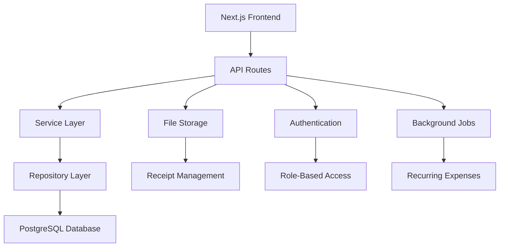

# Design Document

## Overview

The Advanced Expense Tracker is a full-stack web application built with Next.js 14 (App Router), Tailwind CSS, and PostgreSQL. The architecture follows a modular, scalable approach with clear separation of concerns, supporting both individual and team-based expense management with real-time collaboration features.

## Architecture

### High-Level Architecture



### Technology Stack

- **Frontend**: Next.js 14 with App Router, React 18, Tailwind CSS
- **Backend**: Next.js API Routes, Prisma ORM
- **Database**: PostgreSQL with connection pooling
- **Authenticatio: NextAuth.js with JWT tokens
- **File Storage**: Local file system with organized directory structure
- **Charts**: Chart.js or Recharts for data visualization
- **Background Processing**: Node.js cron jobs for recurring expenses

## Components and Interfaces

### Core Data Models

#### User Model
```typescript
interface User {
  id: string
  email: string
  name: string
  createdAt: Date
  updatedAt: Date
  teams: TeamMember[]
  expenses: Expense[]
}
```

#### Expense Model
```typescript
interface Expense {
  id: string
  amount: number
  description: string
  categoryId: string
  category: Category
  date: Date
  receiptUrl?: string
  userId: string
  user: User
  teamId?: string
  team?: Team
  recurringExpenseId?: string
  createdAt: Date
  updatedAt: Date
}
```

#### Category Model
```typescript
interface Category {
  id: string
  name: string
  color: string
  isDefault: boolean
  userId?: string
  teamId?: string
  expenses: Expense[]
}
```

#### Budget Model
```typescript
interface Budget {
  id: string
  name: string
  amount: number
  categoryId?: string
  category?: Category
  startDate: Date
  endDate: Date
  userId: string
  teamId?: string
  spent: number
  createdAt: Date
  updatedAt: Date
}
```

#### Team and Collaboration Models
```typescript
interface Team {
  id: string
  name: string
  createdAt: Date
  members: TeamMember[]
  expenses: Expense[]
  budgets: Budget[]
}

interface TeamMember {
  id: string
  userId: string
  user: User
  teamId: string
  team: Team
  role: 'ADMIN' | 'EDITOR' | 'VIEWER'
  joinedAt: Date
}
```

#### Recurring Expense Model
```typescript
interface RecurringExpense {
  id: string
  amount: number
  description: string
  categoryId: string
  frequency: 'DAILY' | 'WEEKLY' | 'MONTHLY' | 'YEARLY'
  nextDueDate: Date
  isActive: boolean
  userId: string
  teamId?: string
  createdAt: Date
  updatedAt: Date
}
```

### API Endpoints

#### Expense Management
- `GET /api/expenses` - List expenses with filtering and pagination
- `POST /api/expenses` - Create new expense
- `PUT /api/expenses/[id]` - Update expense
- `DELETE /api/expenses/[id]` - Delete expense
- `POST /api/expenses/[id]/receipt` - Upload receipt

#### Category Management
- `GET /api/categories` - List categories
- `POST /api/categories` - Create category
- `PUT /api/categories/[id]` - Update category
- `DELETE /api/categories/[id]` - Delete category

#### Budget Management
- `GET /api/budgets` - List budgets
- `POST /api/budgets` - Create budget
- `PUT /api/budgets/[id]` - Update budget
- `DELETE /api/budgets/[id]` - Delete budget

#### Team Collaboration
- `GET /api/teams` - List user's teams
- `POST /api/teams` - Create team
- `POST /api/teams/[id]/invite` - Invite team member
- `PUT /api/teams/[id]/members/[userId]` - Update member role
- `DELETE /api/teams/[id]/members/[userId]` - Remove member

#### Analytics and Insights
- `GET /api/analytics/dashboard` - Dashboard data
- `GET /api/analytics/insights` - Smart insights
- `GET /api/analytics/export` - CSV export

### Frontend Components Architecture

#### Page Components
- `app/dashboard/page.tsx` - Main dashboard with charts
- `app/expenses/page.tsx` - Expense list and management
- `app/budgets/page.tsx` - Budget tracking
- `app/teams/page.tsx` - Team management
- `app/settings/page.tsx` - User settings

#### Shared Components
- `components/ui/` - Reusable UI components (buttons, forms, modals)
- `components/charts/` - Chart components for analytics
- `components/expense/` - Expense-specific components
- `components/budget/` - Budget-specific components
- `components/team/` - Team collaboration components

#### State Management
- React Context for global state (user, current team)
- SWR for server state management and caching
- Local state with useState/useReducer for component-specific state

## Data Models

### Database Schema Design

#### Core Tables
```sql
-- Users table
CREATE TABLE users (
  id UUID PRIMARY KEY DEFAULT gen_random_uuid(),
  email VARCHAR(255) UNIQUE NOT NULL,
  name VARCHAR(255) NOT NULL,
  password_hash VARCHAR(255) NOT NULL,
  created_at TIMESTAMP DEFAULT NOW(),
  updated_at TIMESTAMP DEFAULT NOW()
);

-- Categories table
CREATE TABLE categories (
  id UUID PRIMARY KEY DEFAULT gen_random_uuid(),
  name VARCHAR(100) NOT NULL,
  color VARCHAR(7) NOT NULL,
  is_default BOOLEAN DEFAULT FALSE,
  user_id UUID REFERENCES users(id),
  team_id UUID REFERENCES teams(id),
  created_at TIMESTAMP DEFAULT NOW()
);

-- Expenses table
CREATE TABLE expenses (
  id UUID PRIMARY KEY DEFAULT gen_random_uuid(),
  amount DECIMAL(10,2) NOT NULL,
  description TEXT NOT NULL,
  category_id UUID REFERENCES categories(id) NOT NULL,
  date DATE NOT NULL,
  receipt_url VARCHAR(500),
  user_id UUID REFERENCES users(id) NOT NULL,
  team_id UUID REFERENCES teams(id),
  recurring_expense_id UUID REFERENCES recurring_expenses(id),
  created_at TIMESTAMP DEFAULT NOW(),
  updated_at TIMESTAMP DEFAULT NOW()
);

-- Budgets table
CREATE TABLE budgets (
  id UUID PRIMARY KEY DEFAULT gen_random_uuid(),
  name VARCHAR(255) NOT NULL,
  amount DECIMAL(10,2) NOT NULL,
  category_id UUID REFERENCES categories(id),
  start_date DATE NOT NULL,
  end_date DATE NOT NULL,
  user_id UUID REFERENCES users(id) NOT NULL,
  team_id UUID REFERENCES teams(id),
  created_at TIMESTAMP DEFAULT NOW(),
  updated_at TIMESTAMP DEFAULT NOW()
);
```

#### Team Collaboration Tables
```sql
-- Teams table
CREATE TABLE teams (
  id UUID PRIMARY KEY DEFAULT gen_random_uuid(),
  name VARCHAR(255) NOT NULL,
  created_at TIMESTAMP DEFAULT NOW()
);

-- Team members table
CREATE TABLE team_members (
  id UUID PRIMARY KEY DEFAULT gen_random_uuid(),
  user_id UUID REFERENCES users(id) NOT NULL,
  team_id UUID REFERENCES teams(id) NOT NULL,
  role VARCHAR(20) NOT NULL CHECK (role IN ('ADMIN', 'EDITOR', 'VIEWER')),
  joined_at TIMESTAMP DEFAULT NOW(),
  UNIQUE(user_id, team_id)
);

-- Recurring expenses table
CREATE TABLE recurring_expenses (
  id UUID PRIMARY KEY DEFAULT gen_random_uuid(),
  amount DECIMAL(10,2) NOT NULL,
  description TEXT NOT NULL,
  category_id UUID REFERENCES categories(id) NOT NULL,
  frequency VARCHAR(20) NOT NULL CHECK (frequency IN ('DAILY', 'WEEKLY', 'MONTHLY', 'YEARLY')),
  next_due_date DATE NOT NULL,
  is_active BOOLEAN DEFAULT TRUE,
  user_id UUID REFERENCES users(id) NOT NULL,
  team_id UUID REFERENCES teams(id),
  created_at TIMESTAMP DEFAULT NOW(),
  updated_at TIMESTAMP DEFAULT NOW()
);
```

### Indexes for Performance
```sql
-- Expense queries optimization
CREATE INDEX idx_expenses_user_date ON expenses(user_id, date DESC);
CREATE INDEX idx_expenses_team_date ON expenses(team_id, date DESC);
CREATE INDEX idx_expenses_category ON expenses(category_id);

-- Budget calculations
CREATE INDEX idx_budgets_user_dates ON budgets(user_id, start_date, end_date);
CREATE INDEX idx_budgets_team_dates ON budgets(team_id, start_date, end_date);
```

## Error Handling

### API Error Responses
```typescript
interface ApiError {
  error: string
  message: string
  statusCode: number
  details?: any
}
```

### Error Categories
1. **Validation Errors** (400) - Invalid input data
2. **Authentication Errors** (401) - Invalid or missing authentication
3. **Authorization Errors** (403) - Insufficient permissions
4. **Not Found Errors** (404) - Resource doesn't exist
5. **Server Errors** (500) - Internal server errors

### Frontend Error Handling
- Global error boundary for unhandled React errors
- Toast notifications for user-facing errors
- Retry mechanisms for network failures
- Graceful degradation for non-critical features

## Testing Strategy

### Unit Testing
- **Models**: Test data validation and business logic
- **API Routes**: Test endpoint functionality and error handling
- **Components**: Test rendering and user interactions
- **Utilities**: Test helper functions and calculations

### Integration Testing
- **Database Operations**: Test CRUD operations with real database
- **API Integration**: Test full request/response cycles
- **Authentication Flow**: Test login/logout and protected routes

### End-to-End Testing
- **User Workflows**: Test complete user journeys
- **Team Collaboration**: Test multi-user scenarios
- **Data Export**: Test CSV generation and download

### Testing Tools
- **Unit/Integration**: Jest + React Testing Library
- **E2E**: Playwright or Cypress
- **Database**: Test database with Docker for isolation
- **API Testing**: Supertest for API endpoint testing

### Performance Considerations

#### Database Optimization
- Connection pooling for PostgreSQL
- Proper indexing for common queries
- Pagination for large datasets
- Query optimization for dashboard analytics

#### Frontend Performance
- Code splitting with Next.js dynamic imports
- Image optimization for receipts
- Lazy loading for charts and heavy components
- SWR caching for frequently accessed data

#### File Storage
- Organized directory structure for receipts
- File size limits and validation
- Cleanup of orphaned files
- CDN consideration for future scaling